# branching

## Ссылка на Network Graph репозитория:

https://github.com/Nano-prototip/branching/network

## Выполненные шаги:

1. Созданы начальные файлы merge.sh и rebase.sh
2. Создана и развита ветка git-merge с двумя коммитами
3. Внесены изменения в main параллельно с разработкой в ветках
4. Создана ветка git-rebase от начального коммита
5. Выполнен merge ветки git-merge в main
6. Выполнен rebase ветки git-rebase на main с разрешением конфликтов
7. Завершен merge ветки git-rebase в main

Все операции выполнены успешно, конфликты разрешены.

## Промежуточные итоги

Промежуточное состояние файлов в скриншотах:

Первый коммит
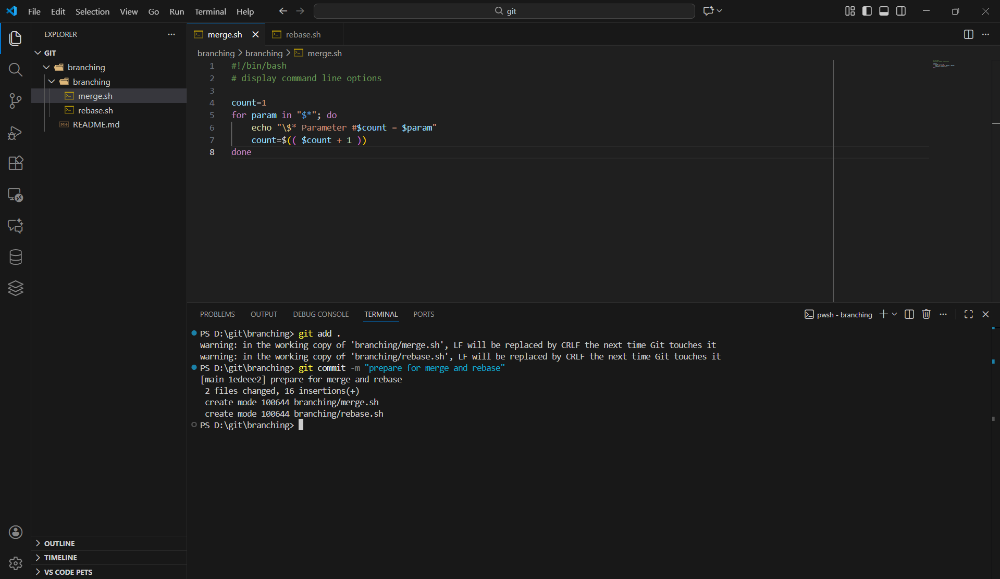

Создал ветку git-merge
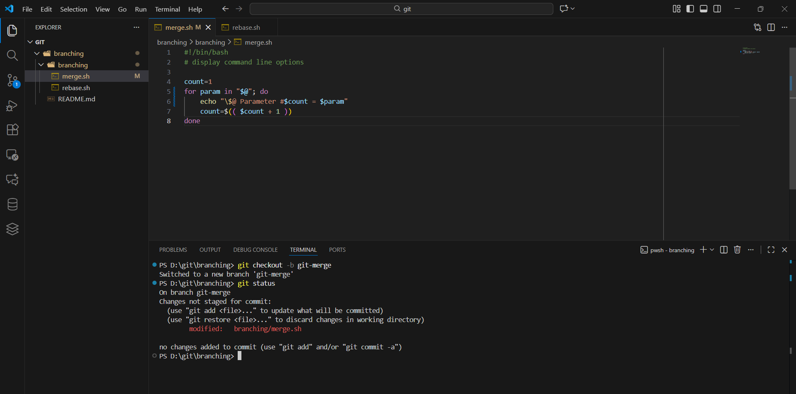

Коммит в ветке git-merge
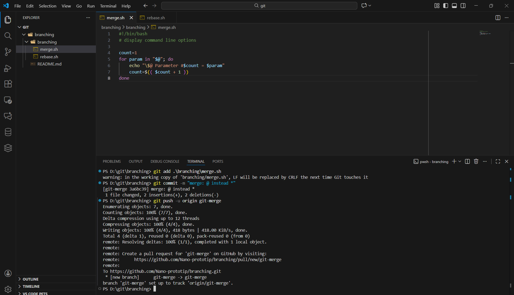

Состояние файлов после модификации
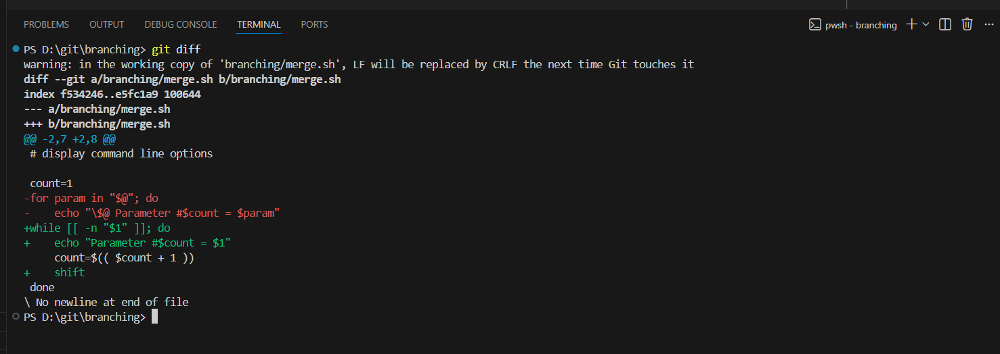

Второй коммит в ветке git-merge
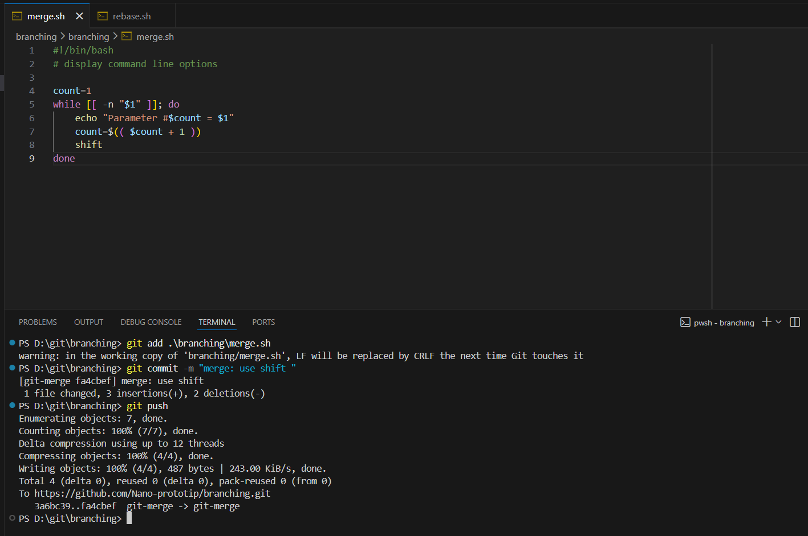

Перемещение в ветку main и коммит
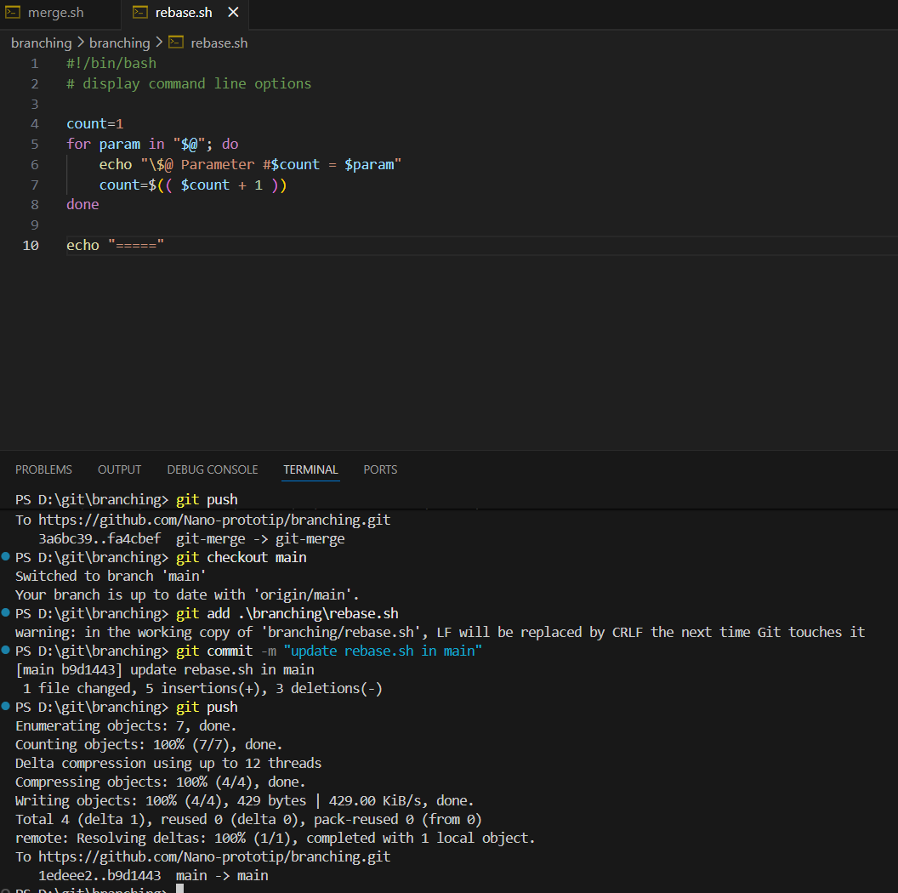

Получение хэша коммита и переключение на него. Далее создал ветку git-rebase от этого коммита.
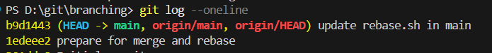
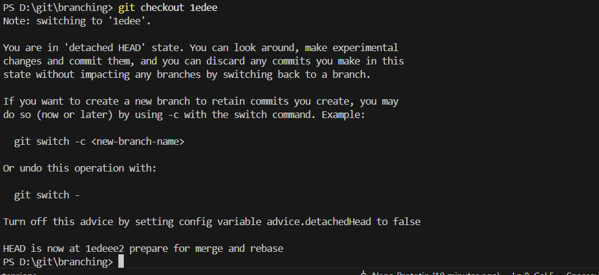
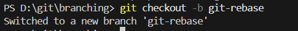

Первый и второй коммиты в ветке git-rebase
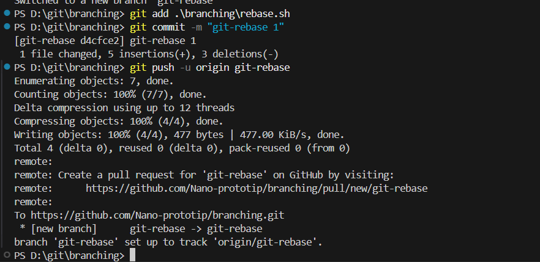
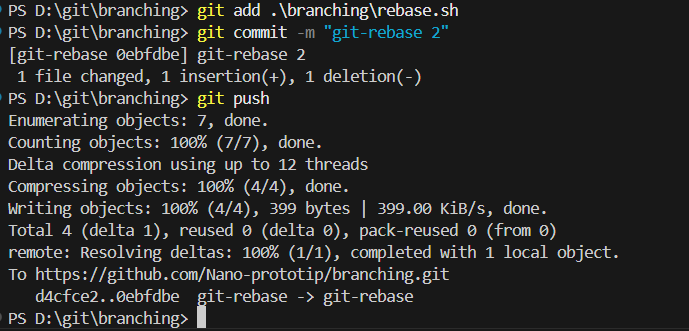

Слияние веток main и git-merge(без конфликтов)
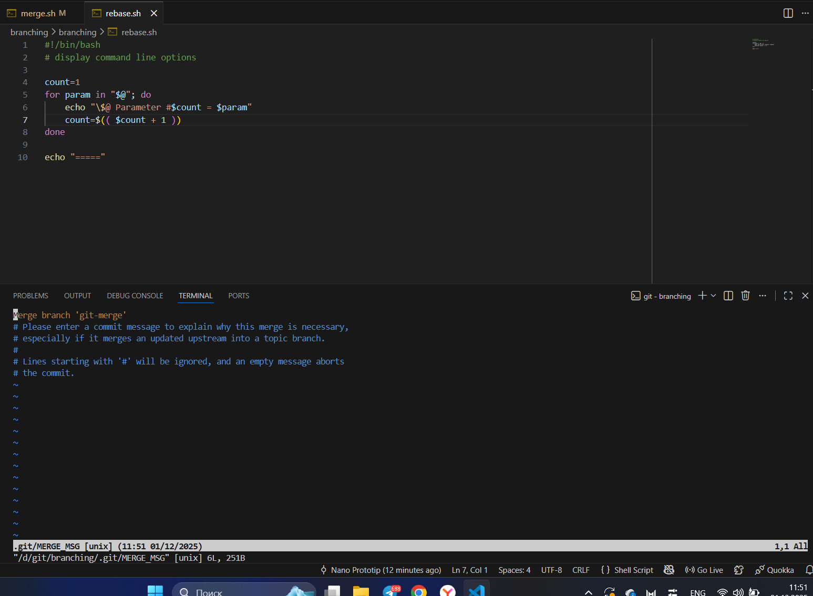
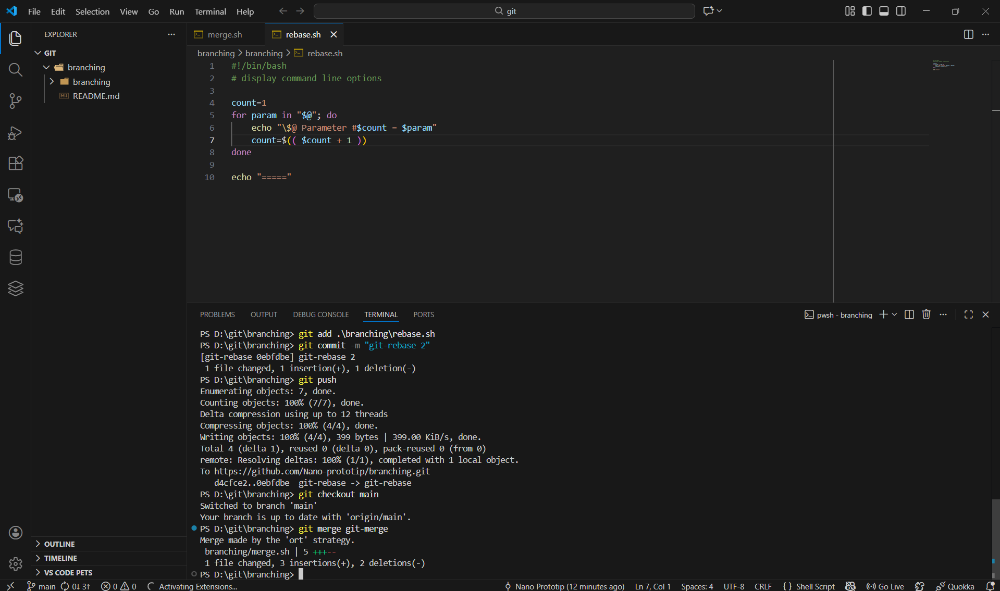

Состояние network graph после слияния
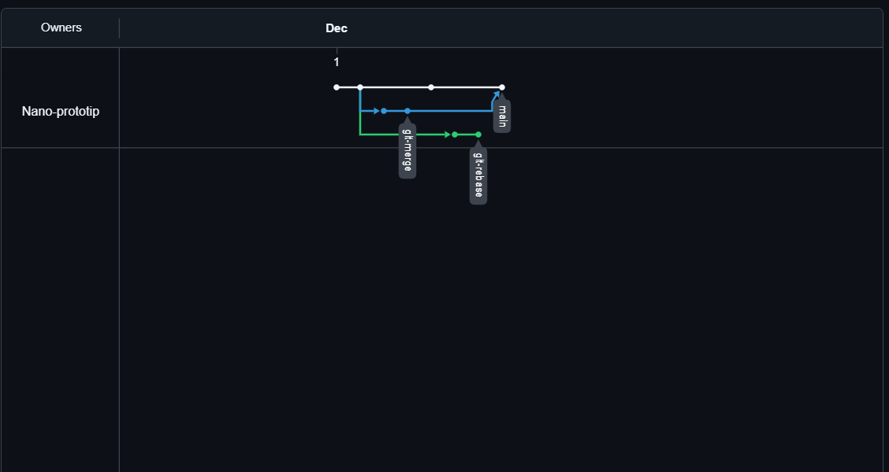

rebase веток main и git-rebase
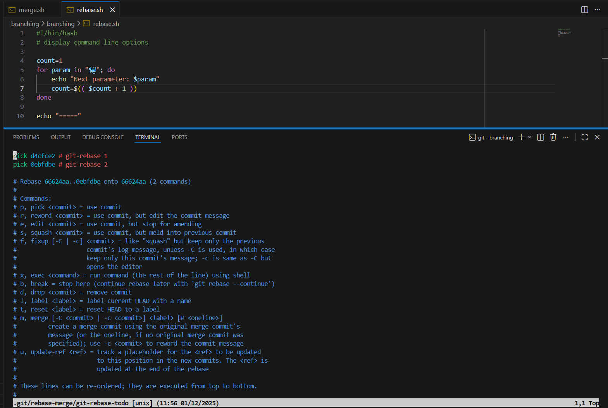

Первый конфликт(выбрал current change)
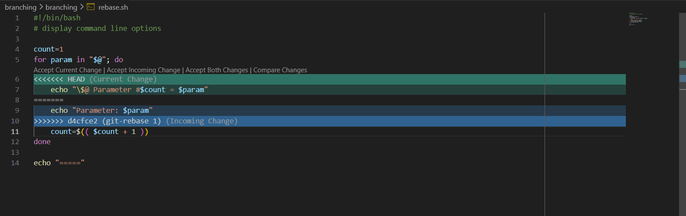

Продолжение и второй конфликт(выбрал incoming change)
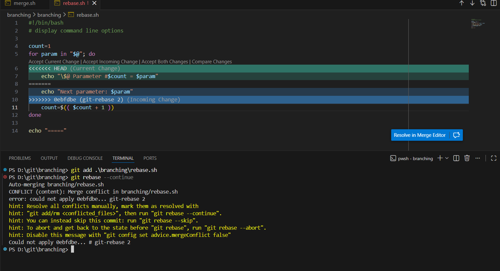

Слияние веток git-merge и main

Ошибка после git push(из за того, что изменили историю)
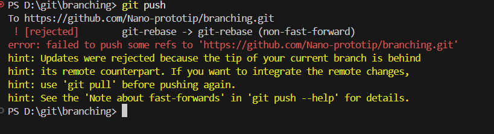

Форсируем push
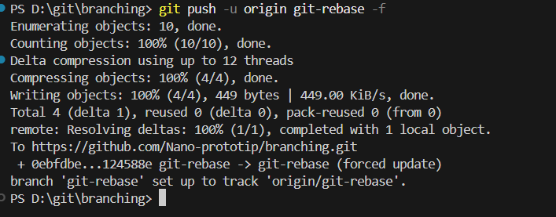
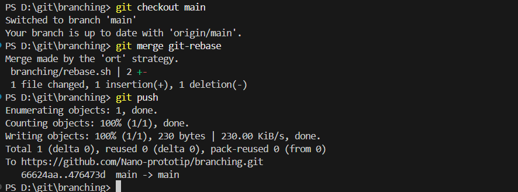

Состояние netwotk graph после завершения работы
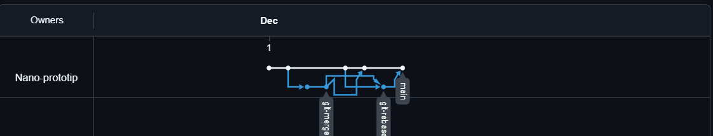